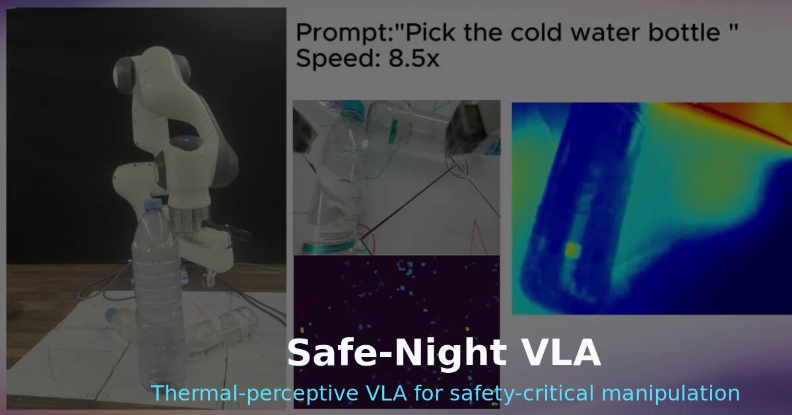
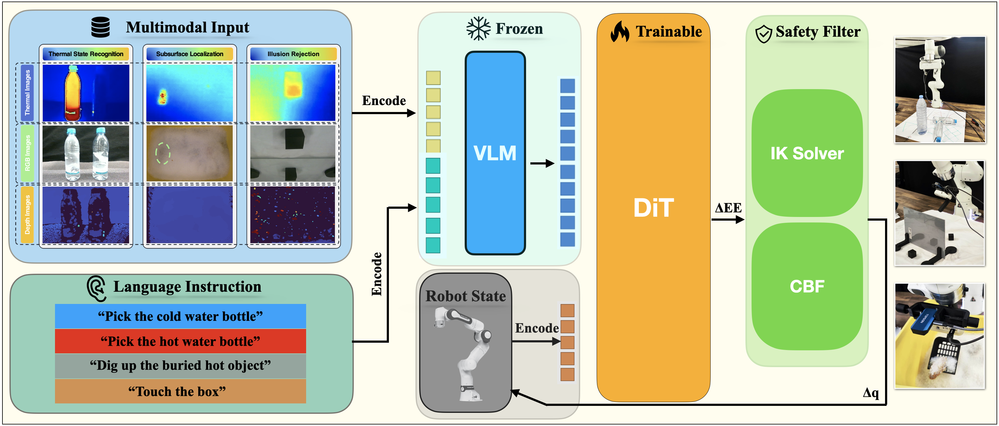
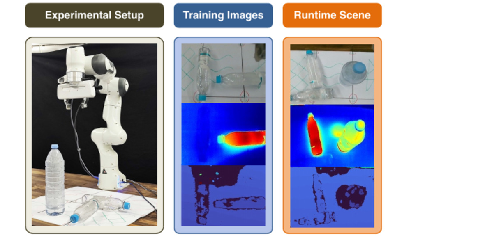
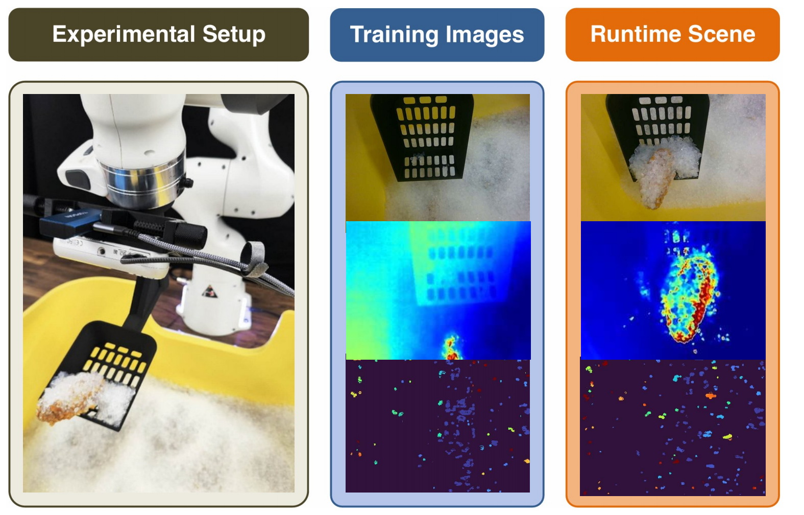
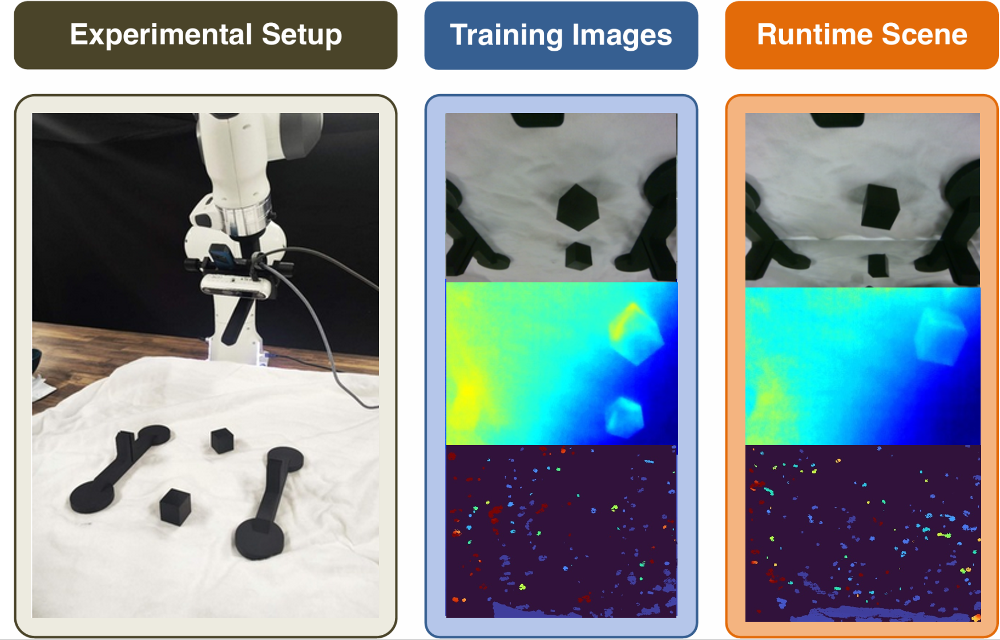
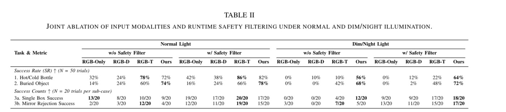
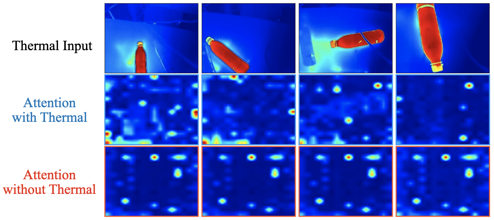

# Safe-Night VLA

**Seeing the Unseen via Thermal-Perceptive Vision-Language-Action Models for Safety-Critical Manipulation**

[](static/pdfs/safenight-vla.pdf)
[](https://arxiv.org/abs/2603.05754)

Safe-Night VLA equips a pre-trained VLA policy with synchronized RGB, LWIR thermal, and depth observations, then constrains execution through a runtime IK plus CBF-QP safety filter for thermodynamic and low-light manipulation.

This paper has been accepted to the **2026 IEEE/RSJ International Conference on Intelligent Robots and Systems (IROS 2026)**.



## Authors

Dian Yu*, Qingchuan Zhou*, Bingkun Huang, Majid Khadiv, Zewen Yang  
Munich Institute of Robotics and Machine Intelligence, Technical University of Munich

*Equal contribution. Zewen Yang is the corresponding author.*

## Project Links

- Paper PDF: [`static/pdfs/safenight-vla.pdf`](static/pdfs/safenight-vla.pdf)
- arXiv: <https://arxiv.org/abs/2603.05754>
- Code repository: <https://github.com/Thisanwerss/Safe-Night-VLA>
- Full demo video: [`static/videos/safenight-vla-demo.mp4`](static/videos/safenight-vla-demo.mp4)

## Core Idea

Current VLA policies rely heavily on RGB observations, which makes thermodynamic state, buried targets, and optical deception hard to resolve. Safe-Night VLA adds LWIR thermal perception to a frozen vision-language backbone and trains only the action-side components, allowing the policy to ground prompts such as hot, cold, and buried in non-visible physical evidence.

The framework is paired with a runtime control barrier function filter. The VLA proposes task-driven Cartesian intent, while the IK plus CBF-QP layer converts it into safe joint displacements under modeled workspace constraints.

## Method

Safe-Night VLA follows a thermal-aware VLA stack with a hard runtime safety layer:

1. **RGB-T-D input**: synchronized RGB, LWIR thermal, and depth observations.
2. **Frozen VLM backbone**: the visual-language encoder remains frozen to preserve pre-trained semantic structure.
3. **Trainable diffusion transformer action head**: the action head maps multimodal tokens, robot state, and language instructions to 6-DoF end-effector deltas plus gripper commands.
4. **Runtime IK plus CBF safety filter**: a post-hoc safety layer enforces joint limits and workspace barriers before robot execution.



## Experiments

The physical benchmark targets three RGB failure modes where thermal observations reveal states that RGB and depth alone cannot reliably expose.

| Scenario | Failure Mode | Preview |
| --- | --- | --- |
| Temperature-conditioned manipulation | The robot must pick the hot or cold bottle when visually similar objects differ by temperature. |  |
| Subsurface localization | A thermal bloom through granular media guides the policy toward a buried hot object that is almost invisible in RGB. |  |
| Illusion rejection | LWIR attenuation in common glass helps reject mirror reflections that appear plausible in visible light. |  |

## Results

Safe-Night VLA improves thermal state recognition, subsurface localization, and illusion rejection under dim/night conditions while keeping execution bounded through the safety filter.

| Metric | Safe-Night VLA Result |
| --- | --- |
| Hot/cold bottle success under dim/night + safety | 64% |
| Buried object localization under dim/night + safety | 72% |
| Mirror rejection under dim/night + safety | 17/20 |
| Hot-object attention mass with thermal input | 53.5% |





## Citation

```bibtex
@misc{yu2026nightvla,
      title={Safe-Night VLA: Seeing the Unseen via Thermal-Perceptive Vision-Language-Action Models for Safety-Critical Manipulation}, 
      author={Dian Yu and Qingchuan Zhou and Bingkun Huang and Majid Khadiv and Zewen Yang},
      year={2026},
      eprint={2603.05754},
      archivePrefix={arXiv},
      primaryClass={cs.RO},
      url={https://arxiv.org/abs/2603.05754}, 
}
```

## License

The website source code is released under the MIT License.

Unless otherwise stated, the paper, figures, videos, data, model weights, and other media assets are copyright of the authors and are not covered by the MIT License.
