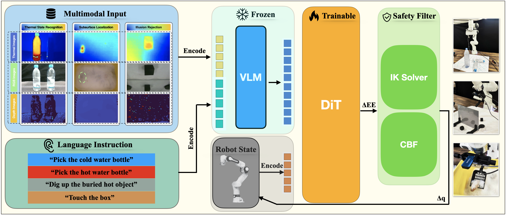
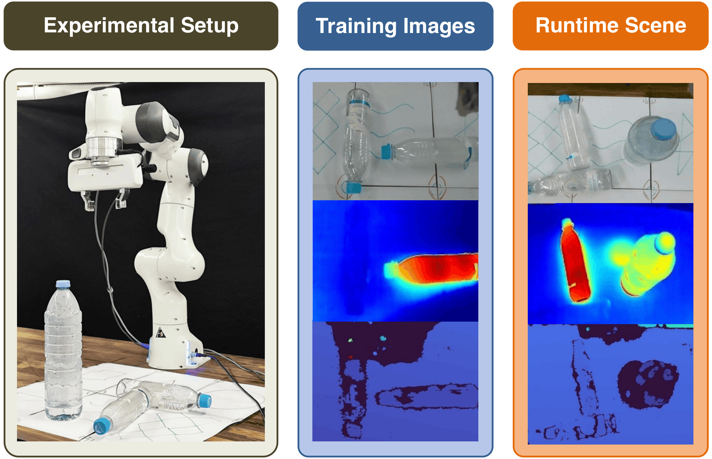
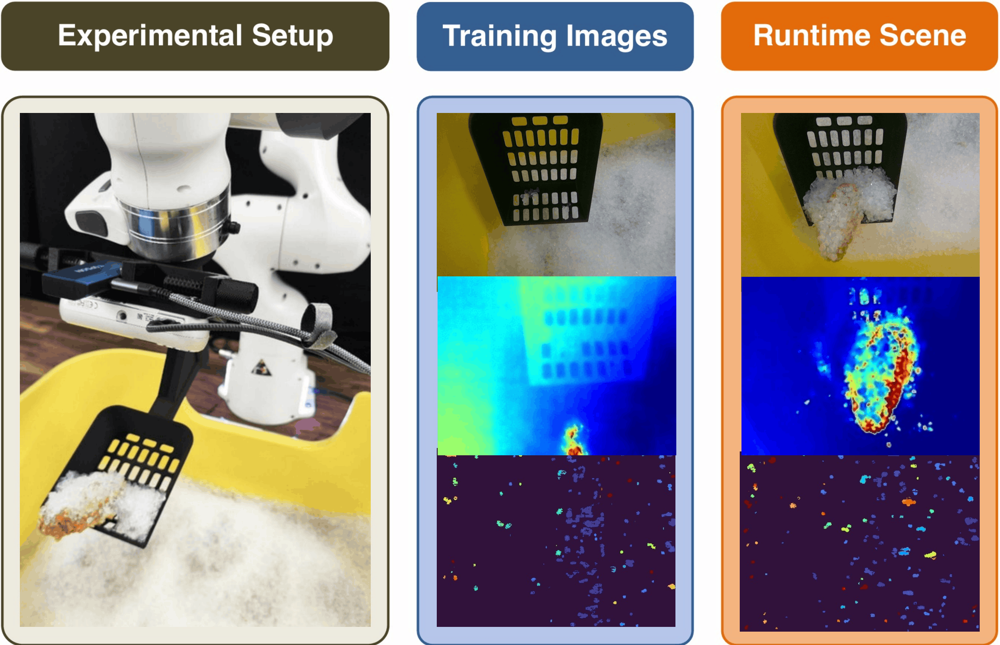
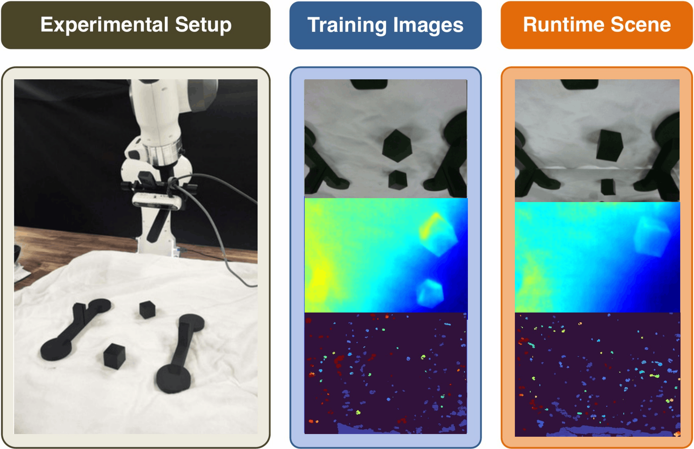

# Safe-Night VLA

**Seeing the Unseen via Thermal-Perceptive Vision-Language-Action Models for Safety-Critical Manipulation**

[](https://arxiv.org/abs/2603.05754)

[](LICENSE)

Safe-Night VLA extends a pretrained vision-language-action policy with synchronized RGB, LWIR thermal, and depth observations. A runtime inverse-kinematics and control-barrier-function safety filter constrains execution for thermodynamic, low-light, and visually ambiguous manipulation tasks.

Accepted at the **2026 IEEE/RSJ International Conference on Intelligent Robots and Systems (IROS 2026)**.



## Authors

Dian Yu\*, Qingchuan Zhou\*, Bingkun Huang, Majid Khadiv, and Zewen Yang†<br>
Munich Institute of Robotics and Machine Intelligence, Technical University of Munich

\* Equal contribution. † Corresponding author: [zewen.yang@tum.de](mailto:zewen.yang@tum.de)

## What Safe-Night VLA Adds

- **Thermal state recognition:** distinguishes visually similar objects using physical temperature cues.
- **Subsurface localization:** detects heat signatures from targets hidden beneath granular material.
- **Illusion rejection:** uses LWIR attenuation through glass to reject misleading mirror reflections.
- **Runtime safety:** filters policy actions through inverse kinematics and a CBF-QP layer before execution.
- **Efficient adaptation:** freezes the vision-language backbone and trains the diffusion-transformer action head.

## Method

The policy processes language instructions, robot state, and synchronized RGB-T-D observations through four stages:

1. **Multimodal input:** RGB provides appearance, LWIR reveals heat, and depth supplies illumination-invariant geometry.
2. **Frozen VLM:** the pretrained visual-language encoder preserves its semantic representation.
3. **Trainable DiT action head:** multimodal tokens are mapped to 6-DoF end-effector deltas and gripper commands.
4. **IK and CBF-QP safety filter:** proposed actions are converted into joint displacements that respect modeled joint and workspace constraints.

The project page also includes an interactive diagram for switching between inference and fine-tuning views.

## Experiments

<table>
  <thead>
    <tr>
      <th align="center">1. Temperature-conditioned manipulation</th>
      <th align="center">2. Subsurface localization</th>
      <th align="center">3. Illusion rejection</th>
    </tr>
  </thead>
  <tbody>
    <tr>
      <td>The robot selects a hot or cold bottle even when the objects look nearly identical in RGB.</td>
      <td>A thermal bloom guides the robot toward a buried hot object that is almost invisible in RGB.</td>
      <td>Thermal evidence helps the policy distinguish a physical object from its mirror reflection.</td>
    </tr>
    <tr>
      <td></td>
      <td></td>
      <td></td>
    </tr>
  </tbody>
</table>

## Results

| Evaluation | Safe-Night VLA result |
| --- | ---: |
| Hot/cold bottle, dim/night light with safety filter | **64%** |
| Buried object, dim/night light with safety filter | **72%** |
| Mirror rejection, dim/night light with safety filter | **17/20** |
| Hot-object attention mass with thermal input | **53.5%** |

The project page contains the complete joint ablation table across input modalities, illumination conditions, and runtime safety settings.


## Citation

```bibtex
@misc{yu2026nightvla,
  title        = {Safe-Night VLA: Seeing the Unseen via Thermal-Perceptive Vision-Language-Action Models for Safety-Critical Manipulation},
  author       = {Dian Yu and Qingchuan Zhou and Bingkun Huang and Majid Khadiv and Zewen Yang},
  year         = {2026},
  eprint       = {2603.05754},
  archivePrefix= {arXiv},
  primaryClass = {cs.RO},
  url          = {https://arxiv.org/abs/2603.05754}
}
```

## License

The website source code is released under the [MIT License](LICENSE).

Unless otherwise stated, the paper, figures, videos, data, model weights, and other media assets remain copyright of their authors and are not covered by the MIT License.
